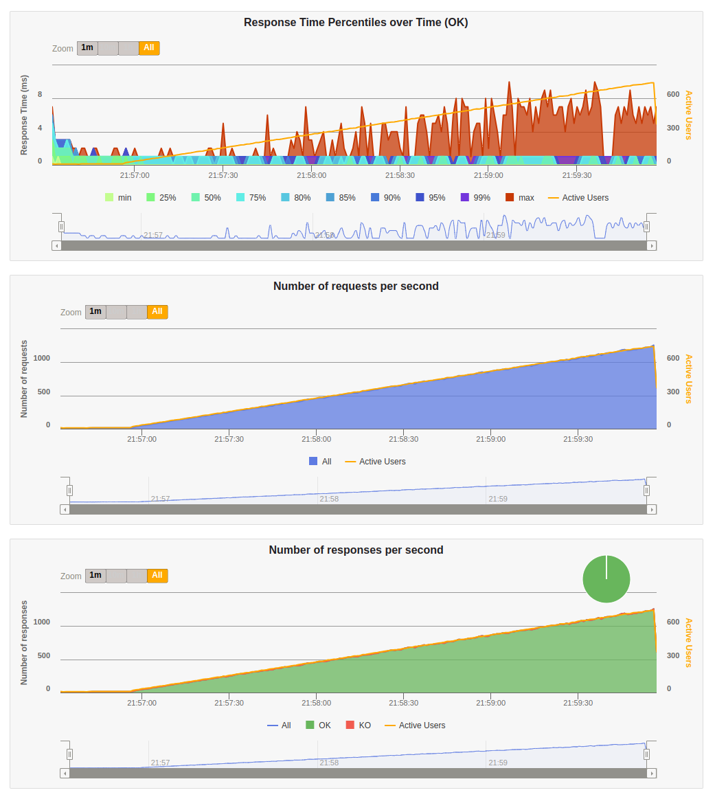

# Rinha de backend

Implementação em elixir da [rinha de backend 2023 Q3](https://github.com/zanfranceschi/rinha-de-backend-2023-q3)

## Objetivo

Implementar a rinha em ruby on rails, e sem fazer nenuma adição de cache e batch insert.

Utilizando os aprendizados anteriores com a [implementação em elixir](https://github.com/ogabriel/rinha-backend-elixir) e [implementação em ruby](https://github.com/ogabriel/rinha-backend-ruby).

## Implementações testadas

1. brincar com as flags:
    a. GOGC
    b. GOMEMLIMIT
    c. GOMAXPROCS

## Conclusões


## Resultados

### Desktop

|CPU|RAM|
|---|---|
|Ryzen 5900X|32GB|

#### Duas instâncias (com nginx)

##### Resultado do gatling navegador


##### Resultado do gatling console

```
Simulation RinhaBackendSimulation completed in 205 seconds
Parsing log file(s)...
Parsing log file(s) done
Generating reports...

================================================================================
---- Global Information --------------------------------------------------------
> request count                                     114991 (OK=114991 KO=0     )
> min response time                                      0 (OK=0      KO=-     )
> max response time                                     10 (OK=10     KO=-     )
> mean response time                                     0 (OK=0      KO=-     )
> std deviation                                          1 (OK=1      KO=-     )
> response time 50th percentile                          0 (OK=0      KO=-     )
> response time 75th percentile                          1 (OK=1      KO=-     )
> response time 95th percentile                          1 (OK=1      KO=-     )
> response time 99th percentile                          1 (OK=1      KO=-     )
> mean requests/sec                                558.209 (OK=558.209 KO=-     )
---- Response Time Distribution ------------------------------------------------
> t < 800 ms                                        114991 (100%)
> 800 ms <= t < 1200 ms                                  0 (  0%)
> t >= 1200 ms                                           0 (  0%)
> failed                                                 0 (  0%)
================================================================================
A contagem de pessoas é: 46576
```

#### Uma instância (sem nginx)

##### Resultado do gatling navegador




##### Resultado do gatling console

```
Simulation RinhaBackendSimulation completed in 205 seconds
Parsing log file(s)...
Parsing log file(s) done
Generating reports...

================================================================================
---- Global Information --------------------------------------------------------
> request count                                     114991 (OK=114991 KO=0     )
> min response time                                      0 (OK=0      KO=-     )
> max response time                                     11 (OK=11     KO=-     )
> mean response time                                     0 (OK=0      KO=-     )
> std deviation                                          0 (OK=0      KO=-     )
> response time 50th percentile                          0 (OK=0      KO=-     )
> response time 75th percentile                          1 (OK=1      KO=-     )
> response time 95th percentile                          1 (OK=1      KO=-     )
> response time 99th percentile                          1 (OK=1      KO=-     )
> mean requests/sec                                558.209 (OK=558.209 KO=-     )
---- Response Time Distribution ------------------------------------------------
> t < 800 ms                                        114991 (100%)
> 800 ms <= t < 1200 ms                                  0 (  0%)
> t >= 1200 ms                                           0 (  0%)
> failed                                                 0 (  0%)
================================================================================
A contagem de pessoas é: 46576
```

### Laptop

|CPU|RAM|
|---|---|
|Ryzen 4750U|16GB|

#### Duas instâncias (com nginx)

##### Resultado do gatling navegador


##### Resultado do gatling console

```
```

##### Recusos do docker durante a parte mais pesada do teste


#### Uma instância (sem nginx)

##### Resultado do gatling navegador


##### Resultado do gatling console

```
```

##### Recusos do docker durante a parte mais pesada do teste


